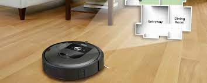

<!DOCTYPE HTML>
<!--
	Spectral by HTML5 UP
	html5up.net | @ajlkn
	Free for personal and commercial use under the CCA 3.0 license (html5up.net/license)
-->
<html>
	<head>
		<title>Spectral by HTML5 UP</title>
		<meta charset="utf-8" />
		<meta name="viewport" content="width=device-width, initial-scale=1, user-scalable=no" />
		<link rel="stylesheet" href="assets/css/main.css" />
		<noscript><link rel="stylesheet" href="assets/css/noscript.css" /></noscript>
	</head>
	<body class="landing is-preload">

		<!-- Page Wrapper -->
			

				<!-- Header -->
				<!---	<header id="header" class="alt">
						<h1><a href="index.html">Spectral</a></h1>
						<nav id="nav">
							<ul>
								<li class="special">
									<a href="#menu" class="menuToggle">Menu</a>
									

										<ul>
											<li><a href="index.html">Home</a></li>
											<li><a href="generic.html">Generic</a></li>
											<li><a href="elements.html">Elements</a></li>
											<li><a href="#">Sign Up</a></li>
											<li><a href="#">Log In</a></li>
										</ul>
									

								</li>
							</ul>
						</nav>
					</header>-->

				<!-- Banner -->
					<section id="banner">
						

							<h2>Vellaiyathambi's internet archive</h2>
							
							
A collection of mostly good projects straight from my keyboard 
 
							
						

						<a href="#one" class="more scrolly">A LI'L ABOUT ME</a>
					</section>

				<!-- One -->
					<section id="one" class="wrapper style1 special">
						

							<header class="major">
								<h2>I AM  A DATA ANALYTICS ENTHUSIATST WITH A PENCHANT FOR CREATIVITE SOLUTIONS
								</h2>
								
I am a google certified data analyst with a few projects under my belt.I constantly fiddle around with things,so expect constant updates here.I am also enthusiatic about writing and design,you find snippets from my pen here from time to time 

							</header>
	                     
						

						<a href="#two" class="more scrolly">Thanks for hanging in there,finally to my work</a>
					</section>

				<!-- Two -->
					<section id="two" class="wrapper alt style2">						
						<section class="spotlight">
							

								<h2><a href="https://github.com/prasannaaav/GoogleDataAnalyticsCapstone">Can a wellness company play it smart?</a> </h2>
								
An anlaysis of fitness tracker data to provide insights to the marketing team of the women's wellness brand <b>Bellabeat</b> (The capstone project for my google data analytics certication)

							
 	
						</section>
						<section class="spotlight">
							

								<h2><a href="https://github.com/prasannaaav/Data_Analysis_Project">AUTOMATING DATA CLEANING</a> 
								</h2>
								
A personl project where i attmept to clean data and report duplicates using a pyhton application created using TKinter

							

						</section>
						<section class="spotlight">
							

								<h2><a href="https://replit.com/@prasannaav">PYTHON PROJECTS</a> 
								</h2>
								
A collection of python projects

							

						</section>
					</section>

				<!-- Footer -->
					<footer id="footer">
						<ul class="icons">
							<li><a href="https://www.kaggle.com/" class="icon brands fa-kaggle">Twitter</a></li>
							<li><a href="https://github.com/prasannaaav/" class="icon brands fa-github">Facebook</a></li>
							<li><a href="https://medium.com/@prasannaav9719" class="icon brands fa-medium">Instagram</a></li>
							<li><a href="https://linkedin.com/in/vellaiyathambi-aruachalam-5b5768171/" class="icon brands fa-linkedin">Dribbble</a></li>
							<li><a href="mailto:prasannaav9719@gmail.com" class="icon solid fa-envelope">Email</a></li>
						</ul>
						<ul class="copyright">
							<li>&copy; Vellaiyathambi Arunachalam</li><li>Designed by: Vellaiyathambi</a></li>
						</ul>
					</footer>

			

		<!-- Scripts -->
			
			
			
			
			
			
			

	</body>
</html>